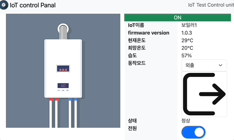

## IoT Simulator for HTTP MQTT CoAP LwM2M




IoT서버의 client 통신 테스트를 위해서 가상의 IoT 기기를 만들었습니다.

nodejs Express.js + mysql + vue + 

#### 실행 방법


```
./backend/config/database.js
```
mysql DB세팅

frontend와 backend의 폴더에서 npm install 실행

```
cd backend 
npm install
cd fronend
npm install
```

MAC 

```
./script.sh
```

WIN
```
준비중
```

### 사용방법


#### UI

```
http://localhost:3000
```

#### HTTP

./backend/routes/iot.js

아래의 주소를 사용함. status는 상태를 나타내며, control은 조작을 함.

```
[GET] /api/iot/status/1000
[PUT] /api/iot/control/1000
```

#### MQTT

./backend/conn/mqtt-device.js 
port : 1883

Topic address

```
iot/status/1000
iot/control/1000
```

#### CoAP


```

```

#### lwM2M

```

```