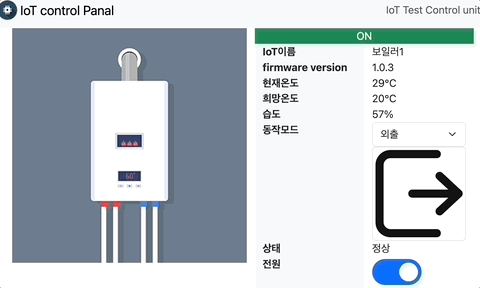
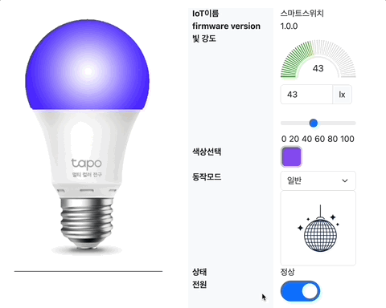

## IoT Simulator




IoT 서버의 클라이언트 통신 테스트를 위한 가상 IoT 디바이스 시뮬레이터입니다.

### 지원 프로토콜

| 프로토콜 | 포트 | 설명 |
|---------|------|------|
| HTTP (REST) | 3000 | Express.js 기반 REST API |
| MQTT | 1883 | Pub/Sub 메시징 |
| CoAP | 5683 | 경량 IoT 프로토콜 |
| BACnet | 47808 | 빌딩 자동화 프로토콜 (node-bacnet) |
| OPC-UA | 4840 | 산업 자동화 프로토콜 (node-opcua) |
| Modbus TCP | 5020 | 산업용 시리얼 통신 프로토콜 (modbus-serial) |

### 시뮬레이션 디바이스

| 디바이스 | ID | 속성 |
|---------|-----|------|
| 보일러 | 1000 | hope_temperature, now_temperature, humidity, mode, switch, status |
| 스마트 LED | 2000 | switch, color, strength, mode, status |

### 기술 스택

- Backend: Node.js, Express.js
- Frontend: Vue 3, Vite, Naive UI
- Storage: JSON 파일 기반 (외부 DB 불필요)

---

## 설치 및 실행

### 1. 의존성 설치

```bash
npm install        # backend + frontend 자동 설치 (postinstall)
```

### 2. 실행

> 외부 데이터베이스가 필요 없습니다. 디바이스 데이터는 `backend/data/` 폴더의 JSON 파일에 저장됩니다.

**간편 실행 (서버 시작 + 브라우저 자동 오픈)**

```bash
npm start
```

또는 파일 더블클릭:
- **macOS**: `IoT-Simulator.command`
- **Windows**: `IoT-Simulator.bat`

**개발 모드 (프론트엔드 핫 리로드)**

```bash
# 터미널 1: 백엔드
npm run server

# 터미널 2: 프론트엔드 개발 서버
npm run dev
```

**프론트엔드 빌드**

```bash
npm run build      # frontend → backend/public 으로 빌드
```

### 3. 접속

- 웹 UI: http://localhost:3000
- 웹 UI에서 프로토콜 선택 드롭다운으로 통신 프로토콜을 변경할 수 있습니다.

---

## 프로토콜별 직접 접근 가이드

프론트엔드 없이 각 프로토콜 클라이언트로 직접 디바이스에 접근할 수 있습니다.

### HTTP (REST)

가장 기본적인 접근 방식입니다.

**상태 조회**

```bash
# 보일러 상태
curl http://localhost:3000/api/iot/status/1000

# 스마트 LED 상태
curl http://localhost:3000/api/iot/status/2000
```

**디바이스 제어**

```bash
# 보일러 전원 ON
curl -X PUT http://localhost:3000/api/iot/control/1000 \
  -H "Content-Type: application/json" \
  -d '{"deviceControl": 1, "deviceControlName": "switch"}'

# 보일러 희망온도 설정
curl -X PUT http://localhost:3000/api/iot/control/1000 \
  -H "Content-Type: application/json" \
  -d '{"deviceControl": 25, "deviceControlName": "hope_temperature"}'

# 보일러 모드 변경 (1:난방, 2:절약, 3:샤워, 4:온돌, 5:외출, 6:고온)
curl -X PUT http://localhost:3000/api/iot/control/1000 \
  -H "Content-Type: application/json" \
  -d '{"deviceControl": 1, "deviceControlName": "mode"}'

# 스마트 LED 전원 ON
curl -X PUT http://localhost:3000/api/iot/control/2000 \
  -H "Content-Type: application/json" \
  -d '{"deviceControl": 1, "deviceControlName": "switch"}'

# 스마트 LED 밝기 설정 (0~100)
curl -X PUT http://localhost:3000/api/iot/control/2000 \
  -H "Content-Type: application/json" \
  -d '{"deviceControl": 80, "deviceControlName": "strength"}'

# 스마트 LED 색상 변경
curl -X PUT http://localhost:3000/api/iot/control/2000 \
  -H "Content-Type: application/json" \
  -d '{"deviceControl": "#f05348", "deviceControlName": "color"}'
```

**프로토콜 경유 조회** (백엔드가 해당 프로토콜 서버를 경유하여 통신)

```bash
curl http://localhost:3000/api/iot/status/1000?protocol=mqtt
curl http://localhost:3000/api/iot/status/1000?protocol=coap
curl http://localhost:3000/api/iot/status/1000?protocol=bacnet
curl http://localhost:3000/api/iot/status/1000?protocol=opcua
curl http://localhost:3000/api/iot/status/1000?protocol=modbus
```

---

### MQTT

포트: **1883**

MQTT 클라이언트(mosquitto_pub/sub, MQTT Explorer 등)로 직접 접근할 수 있습니다.

**상태 구독**

```bash
# 보일러 상태 구독 (3초마다 자동 발행됨)
mosquitto_sub -h localhost -p 1883 -t "iot/status/1000"

# 스마트 LED 상태 구독
mosquitto_sub -h localhost -p 1883 -t "iot/status/2000"
```

**디바이스 제어**

```bash
# 보일러 전원 OFF
mosquitto_pub -h localhost -p 1883 -t "iot/control" \
  -m '{"deviceId":"1000", "deviceControl":"0", "deviceControlName":"switch"}'

# 보일러 희망온도 28도
mosquitto_pub -h localhost -p 1883 -t "iot/control" \
  -m '{"deviceId":"1000", "deviceControl":"28", "deviceControlName":"hope_temperature"}'

# 스마트 LED 밝기 50
mosquitto_pub -h localhost -p 1883 -t "iot/control" \
  -m '{"deviceId":"2000", "deviceControl":"50", "deviceControlName":"strength"}'
```

> MQTT 브로커(mosquitto 등)가 localhost:1883에서 실행 중이어야 합니다.

---

### CoAP

포트: **5683**

CoAP 클라이언트(coap-cli, libcoap 등)로 직접 접근할 수 있습니다.

**상태 조회**

```bash
# coap-cli 설치: npm install -g coap-cli

# 보일러 상태
coap get coap://localhost:5683/iot/status/1000

# 스마트 LED 상태
coap get coap://localhost:5683/iot/status/2000
```

**디바이스 제어**

```bash
# 보일러 전원 ON
echo '{"deviceControl":1,"deviceControlName":"switch"}' | \
  coap put coap://localhost:5683/iot/control/1000

# 스마트 LED 모드 변경 (1:일반, 2:은은한, 3:깜빡임, 4:산타)
echo '{"deviceControl":3,"deviceControlName":"mode"}' | \
  coap put coap://localhost:5683/iot/control/2000
```

---

### BACnet

포트: **47808** (BACnet 표준 포트)

BACnet 클라이언트 또는 `node-bacnet` 라이브러리로 접근합니다.

**오브젝트 매핑**

| 디바이스 | 속성 | Object Type | Instance |
|---------|------|-------------|----------|
| 보일러(1000) | hope_temperature | Analog Value (2) | 1 |
| 보일러(1000) | now_temperature | Analog Value (2) | 2 |
| 보일러(1000) | humidity | Analog Value (2) | 3 |
| 보일러(1000) | mode | Analog Value (2) | 4 |
| 보일러(1000) | switch | Binary Value (5) | 1 |
| 스마트 LED(2000) | strength | Analog Value (2) | 10 |
| 스마트 LED(2000) | mode | Analog Value (2) | 11 |
| 스마트 LED(2000) | switch | Binary Value (5) | 10 |

**Node.js 예제**

```js
const bacnet = require('node-bacnet');
const client = new bacnet();

// ReadProperty — 보일러 희망온도 읽기
client.readProperty('localhost', { type: 2, instance: 1 }, 85, (err, value) => {
  console.log('hope_temperature:', value.values[0].value);
});

// WriteProperty — 보일러 희망온도 설정
client.writeProperty('localhost', { type: 2, instance: 1 }, 85,
  [{ type: 7, value: '25' }], (err) => {
    console.log(err ? 'error' : 'ok');
  }
);
```

---

### OPC-UA

포트: **4840**
엔드포인트: `opc.tcp://localhost:4840/UA/IoTSimulator`

OPC-UA 클라이언트(UaExpert, Prosys OPC UA Browser, node-opcua 등)로 접근합니다.

**노드 구조**

```
Objects/
  └─ IoTDevices/
       ├─ Boiler_1000/
       │    ├─ hope_temperature  (ns=1;s=1000_hope_temperature)
       │    ├─ now_temperature   (ns=1;s=1000_now_temperature)
       │    ├─ humidity          (ns=1;s=1000_humidity)
       │    ├─ mode              (ns=1;s=1000_mode)
       │    ├─ switch            (ns=1;s=1000_switch)
       │    └─ status            (ns=1;s=1000_status)
       └─ SmartSwitch_2000/
            ├─ switch            (ns=1;s=2000_switch)
            ├─ color             (ns=1;s=2000_color)
            ├─ strength          (ns=1;s=2000_strength)
            ├─ mode              (ns=1;s=2000_mode)
            └─ status            (ns=1;s=2000_status)
```

**Node.js 예제**

```js
const opcua = require('node-opcua');

async function main() {
  const client = opcua.OPCUAClient.create({ endpointMustExist: false });
  await client.connect('opc.tcp://localhost:4840/UA/IoTSimulator');
  const session = await client.createSession();

  // 읽기 — 보일러 희망온도
  const result = await session.read({ nodeId: 'ns=1;s=1000_hope_temperature' });
  console.log('hope_temperature:', result.value.value);

  // 쓰기 — 보일러 희망온도 설정
  await session.write({
    nodeId: 'ns=1;s=1000_hope_temperature',
    attributeId: opcua.AttributeIds.Value,
    value: {
      value: new opcua.Variant({ dataType: opcua.DataType.String, value: '28' })
    }
  });

  await session.close();
  await client.disconnect();
}
main();
```

---

### Modbus TCP

포트: **5020**

Modbus TCP 클라이언트(modpoll, QModMaster, modbus-serial 등)로 접근합니다.

**레지스터 매핑**

| 레지스터 주소 | 디바이스 | 속성 |
|-------------|---------|------|
| 0 | 보일러(1000) | hope_temperature |
| 1 | 보일러(1000) | now_temperature |
| 2 | 보일러(1000) | humidity |
| 3 | 보일러(1000) | mode |
| 4 | 보일러(1000) | switch |
| 100 | 스마트 LED(2000) | switch |
| 101 | 스마트 LED(2000) | strength |
| 102 | 스마트 LED(2000) | mode |

**지원 Function Code**

- FC03: Read Holding Registers (레지스터 읽기)
- FC06: Write Single Register (레지스터 쓰기)

**modpoll 예제**

```bash
# 보일러 레지스터 5개 읽기 (주소 0~4)
modpoll -m tcp -p 5020 -r 1 -c 5 localhost

# 보일러 희망온도를 25로 설정 (레지스터 0)
modpoll -m tcp -p 5020 -r 1 -c 1 localhost 25

# 스마트 LED switch ON (레지스터 100)
modpoll -m tcp -p 5020 -r 101 -c 1 localhost 1
```

**Node.js 예제**

```js
const ModbusRTU = require('modbus-serial');
const client = new ModbusRTU();

client.connectTCP('localhost', { port: 5020 }, () => {
  client.setID(1);

  // 읽기 — 보일러 희망온도 (레지스터 0)
  client.readHoldingRegisters(0, 1, (err, data) => {
    console.log('hope_temperature:', data.data[0]);
  });

  // 쓰기 — 보일러 희망온도를 25로 설정
  client.writeRegister(0, 25, (err) => {
    console.log(err ? 'error' : 'ok');
  });
});
```

---

## 프로젝트 구조

```
iot-simulator/
├── launcher.js              # 통합 런처 (서버 시작 + 브라우저 오픈)
├── IoT-Simulator.command    # macOS 더블클릭 실행 파일
├── IoT-Simulator.bat        # Windows 더블클릭 실행 파일
├── backend/
│   ├── bin/www              # Express 서버 엔트리포인트
│   ├── app.js               # Express 앱 설정
│   ├── config/
│   │   ├── storage.js       # JSON 파일 기반 스토리지
│   │   └── batch.js         # 배치 작업 (5초 주기)
│   ├── data/
│   │   ├── devices.json     # 디바이스 마스터 데이터
│   │   └── values.json      # 디바이스 값 (런타임 수정됨)
│   ├── conn/
│   │   ├── mqtt-device.js   # MQTT 서버 핸들러
│   │   ├── coap-device.js   # CoAP 서버 핸들러
│   │   ├── bacnet-device.js # BACnet 서버 핸들러
│   │   ├── opcua-device.js  # OPC-UA 서버 핸들러
│   │   ├── modbus-device.js # Modbus TCP 서버 핸들러
│   │   └── protocol-client.js # 프로토콜 클라이언트 (라우터→서버 통신)
│   ├── routes/
│   │   ├── index.js
│   │   └── iot.js           # IoT REST API
│   └── public/              # 빌드된 프론트엔드
└── frontend/                # Vue 3 + Naive UI 소스
```
